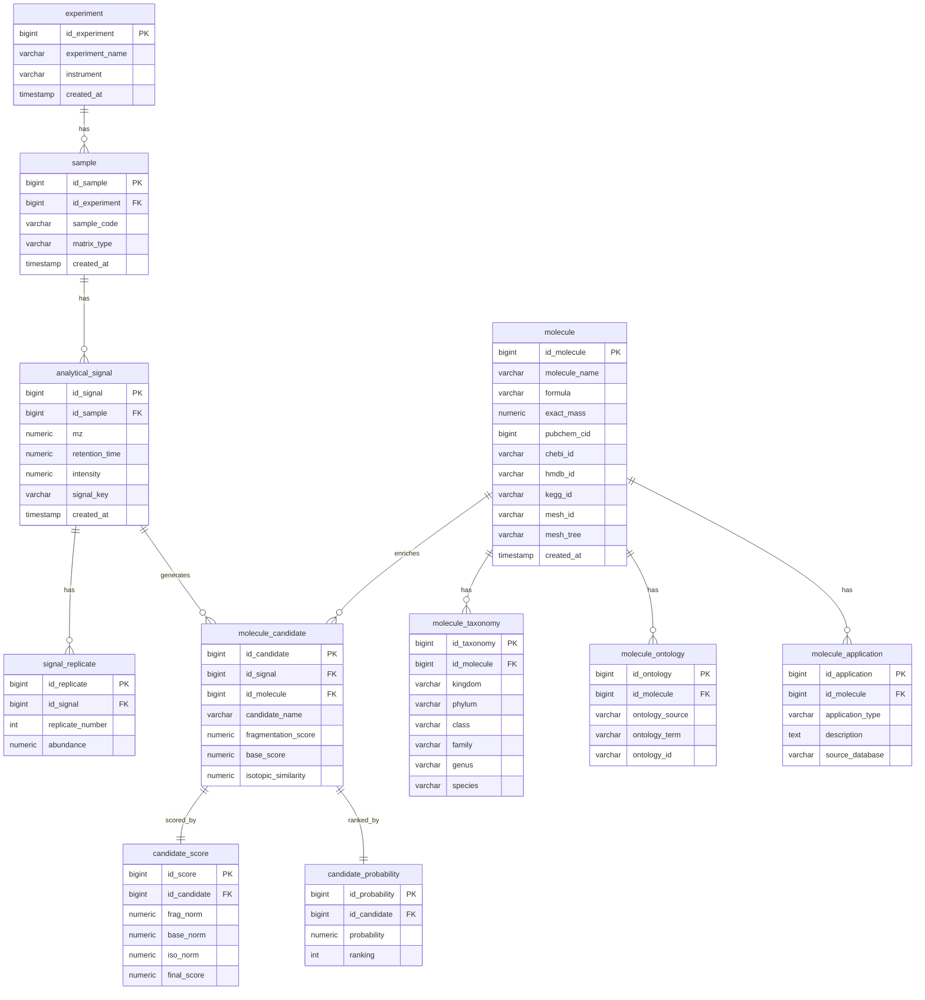

# Diagrama ER — QuimioAnalytics

Abaixo está o diagrama entidade-relacionamento do banco PostgreSQL do projeto.

## Leitura rápida

- **Rastreabilidade**: `experiment` → `sample` → `analytical_signal` → `molecule_candidate`.
- **Replicatas dinâmicas**: `signal_replicate` permite N replicatas por sinal.
- **Top 5**: `candidate_probability.ranking` suporta seleção para dashboard.
- **Enriquecimento científico**: `molecule` e tabelas filhas armazenam taxonomia, ontologia e aplicações.
